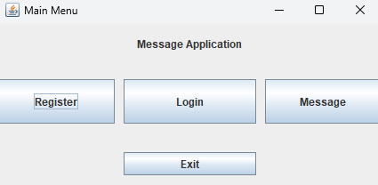
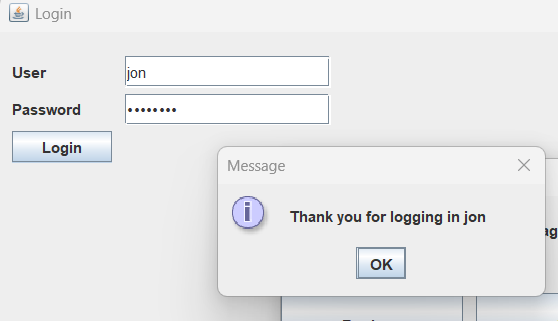
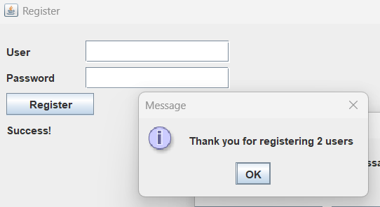
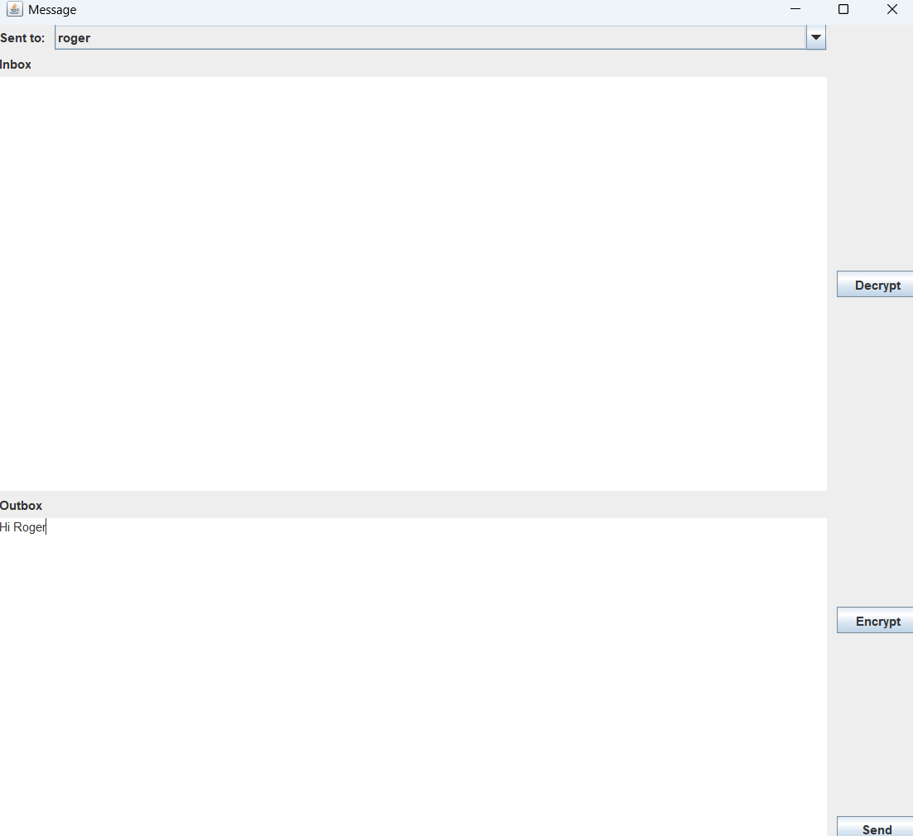
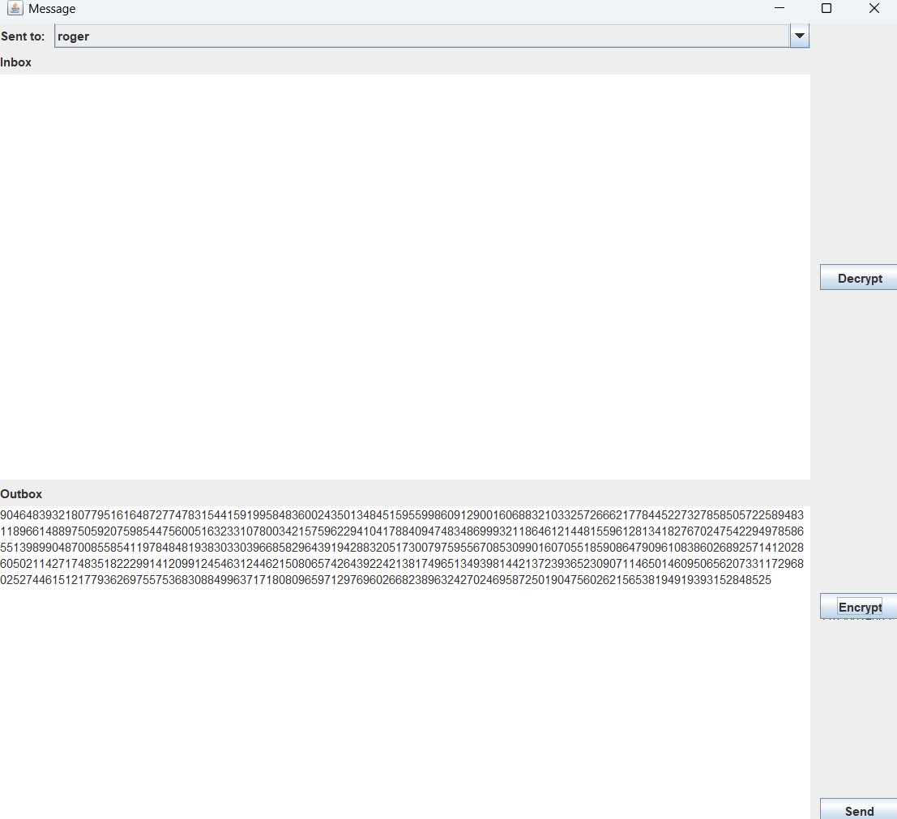
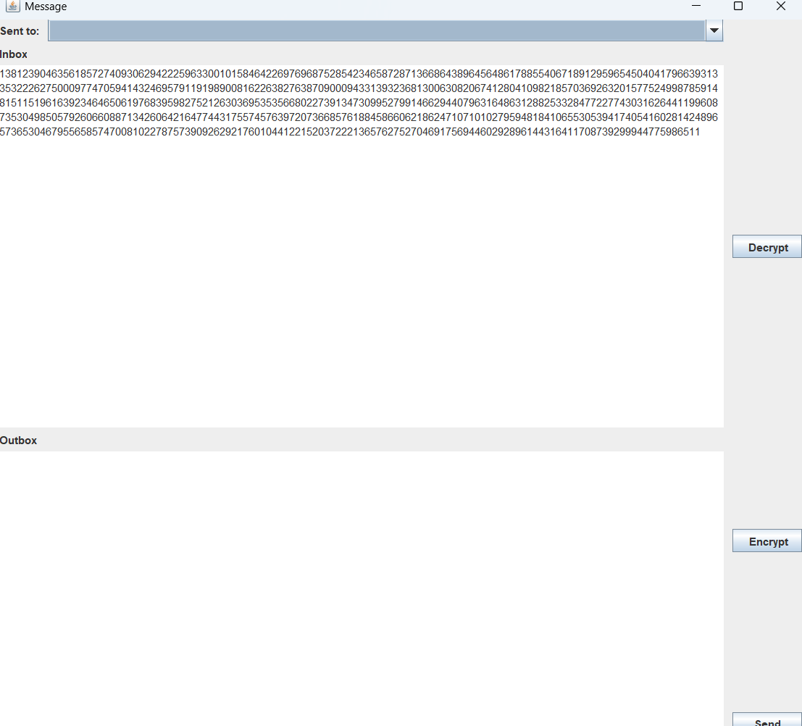
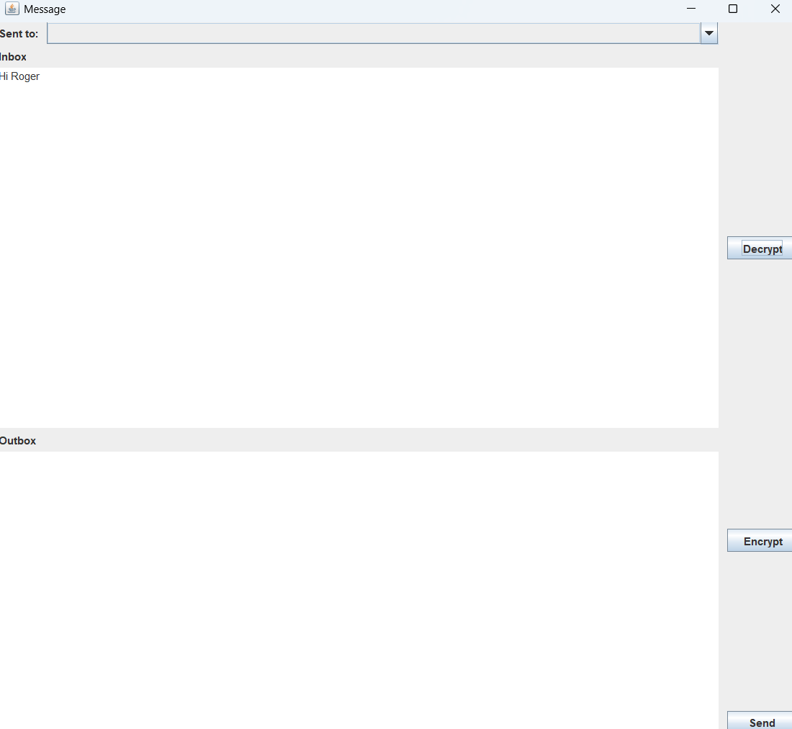

# RSA Message App

A secure desktop messaging application built in Java that implements custom RSA encryption for private communication between users.

## Overview

This application provides a secure messaging platform using a custom implementation of the RSA cryptographic algorithm. Users can register accounts, log in securely, and send encrypted messages to other registered users through an intuitive Swing-based GUI.

## Features

### 🔐 Security Features
- **Custom RSA Implementation**: Built-from-scratch RSA encryption using 1024-bit prime numbers
- **Secure Password Storage**: SHA-256 hashing with random salt generation
- **End-to-End Encryption**: Messages are encrypted with recipient's public key
- **Brute Force Protection**: Account lockout after 3 failed login attempts

### 💬 Messaging Features
- **User Registration**: Create accounts with username and password
- **Secure Login**: Authentication with salted password verification
- **Encrypted Messaging**: Send RSA-encrypted messages to registered users  
- **Message Inbox**: View and decrypt received messages
- **User Selection**: Choose message recipients from dropdown menu

### 🖥️ User Interface
- **Main Menu**: Central hub for navigation
- **Registration GUI**: User-friendly account creation
- **Login GUI**: Secure authentication interface
- **Message GUI**: Comprehensive messaging interface with encryption/decryption controls

## Technical Implementation

### RSA Encryption Details
- **Key Generation**: Uses 1024-bit probable primes for p and q
- **Public Key**: (N, e) where N = p×q and e is coprime to φ(N)
- **Private Key**: d = e⁻¹ mod φ(N) where φ(N) = (p-1)(q-1)
- **Encryption**: C = M^e mod N
- **Decryption**: M = C^d mod N

### Security Architecture
- **Password Security**: Concatenated salt + password hashed with SHA-256
- **Key Management**: Each user gets unique RSA key pair upon registration
- **Message Storage**: Encrypted messages stored in user inbox
- **Session Management**: User authentication required for messaging

## Screenshots

### Main Menu


*The main application interface showing Register, Login, Message, and Exit options*

### User Login


*Login interface with username/password fields and security lockout protection*

### User Registration


*Registration form where users create accounts with username and password*

### Writing Messages


*Message composition interface showing text area for writing messages to other users*

### Message Encryption


*Demonstration of message being encrypted with recipient's public key after pressing the encrypt button*

### Receiving Messages


*Message inbox showing received encrypted messages from other users*

### Message Decryption


*Encrypted message being decrypted into plaintext after pressing the decrypt button*

## Getting Started

### Prerequisites
- Java Development Kit (JDK) 8 or higher
- Java Swing support

### Running the Application
1. Clone this repository
2. Compile the Java files:
   ```bash
   javac src/*.java
   ```
3. Run the application:
   ```bash
   java -cp src Main
   ```

### Usage Workflow
1. **Register Users**: Click "Register" to create new user accounts
2. **Login**: Click "Login" and enter credentials for an existing user
3. **Send Messages**: 
   - Click "Message" after logging in
   - Select recipient from dropdown
   - Type message in lower text area
   - Click "Encrypt" to encrypt with recipient's public key
   - Click "Send" to deliver the encrypted message
4. **Read Messages**:
   - View received messages in upper text area
   - Click "Decrypt" to decrypt with your private key

## File Structure

```
RSA-Message-App/
├── src/
│   ├── Main.java              # Application entry point
│   ├── RSA.java               # Custom RSA implementation
│   ├── User.java              # User model with authentication
│   ├── MainMenu.java          # Main navigation GUI
│   ├── RegisterGui.java       # User registration interface
│   ├── LoginGui.java          # User authentication interface
│   ├── MessageGui.java        # Messaging interface
│   └── *.form                 # GUI form files
└── README.md
```

## Security Considerations

⚠️ **Educational Purpose**: This implementation is designed for learning cryptographic concepts. For production use, consider:
- Using established cryptographic libraries (Java Cryptography Extension)
- Implementing proper key exchange protocols
- Adding message integrity verification
- Using longer key lengths (2048+ bits)
- Implementing secure key storage

## License

This project is created for educational purposes to demonstrate RSA encryption implementation and secure messaging concepts.
